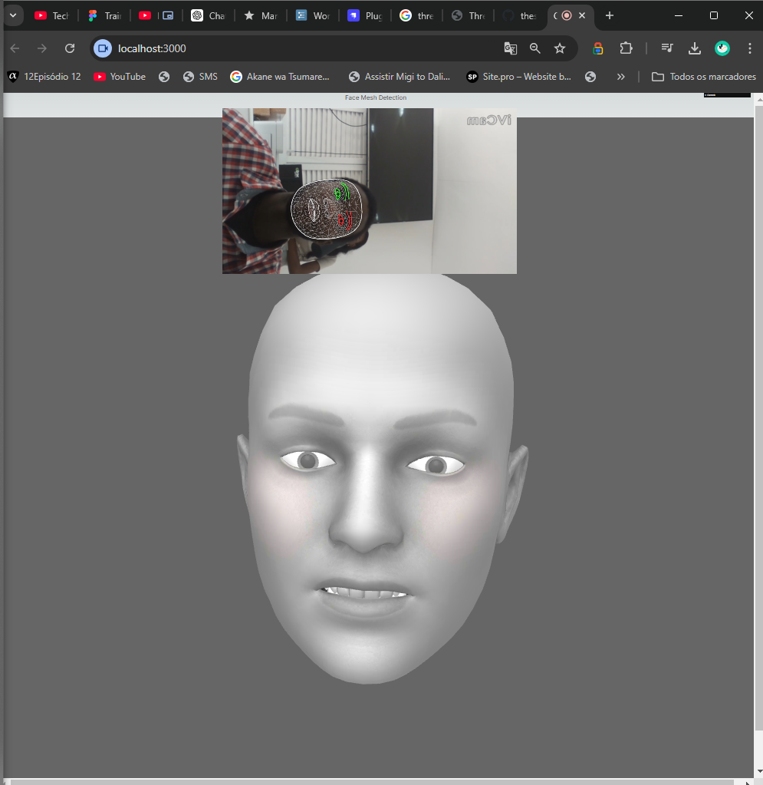

Claro! A seguir, apresento um exemplo de descrição para o projeto que você pode usar no GitHub. Essa descrição aborda o propósito do projeto, as principais funcionalidades e como configurar o ambiente de desenvolvimento.

---




# Face Mesh Detection with MediaPipe and Three.js

**Face Mesh Detection with MediaPipe** é um projeto de demonstração que utiliza o framework [Next.js](https://nextjs.org/) para criar uma aplicação web que exibe detecção de malha facial em tempo real usando a biblioteca [MediaPipe](https://google.github.io/mediapipe/). Além disso, a aplicação integra uma cena 3D utilizando [Three.js](https://threejs.org/) para uma visualização interativa adicional.

## Funcionalidades

- **Detecção de Malha Facial**: Utiliza a API do MediaPipe para detectar e traçar a malha facial em tempo real.
- **Visualização 3D**: Renderiza uma cena 3D interativa com Three.js para complementar a visualização da malha facial.
- **Interface Reativa**: Desenvolvido com Next.js, oferecendo uma interface moderna e responsiva.

## Tecnologias Utilizadas

- [Next.js](https://nextjs.org/): Framework React para aplicações web.
- [MediaPipe](https://google.github.io/mediapipe/): Biblioteca para detecção e rastreamento de características faciais.
- [Three.js](https://threejs.org/): Biblioteca JavaScript para renderização de gráficos 3D.
- [React](https://reactjs.org/): Biblioteca para construção de interfaces de usuário.

## Instalação e Configuração

1. **Clone o repositório**:
   ```bash
   git clone https://github.com/SeuUsuario/SeuProjeto.git
   cd SeuProjeto
   ```

2. **Instale as dependências**:
   ```bash
   npm install
   ```

3. **Configure as variáveis de ambiente** (se necessário):
   Crie um arquivo `.env.local` na raiz do projeto e adicione as variáveis de ambiente necessárias.

4. **Inicie o servidor de desenvolvimento**:
   ```bash
   npm run dev
   ```

5. **Abra o navegador** e vá para `http://localhost:3000` para ver a aplicação em execução.

## Estrutura do Projeto

- **/components**: Contém componentes React, incluindo `FaceMeshClient` e `ThreeScene`.
- **/pages**: Contém as páginas do Next.js. O componente principal está em `index.tsx`.
- **/public**: Arquivos públicos estáticos, como ícones e imagens.
- **/styles**: Arquivos de estilo para a aplicação.

## Contribuição

Contribuições são bem-vindas! Para colaborar com o projeto, siga estas etapas:

1. **Fork o repositório** e crie uma branch para sua funcionalidade ou correção de bug.
2. Faça suas alterações e teste-as localmente.
3. Envie um Pull Request com uma descrição clara das alterações feitas.

## Licença

Este projeto está licenciado sob a [MIT License](LICENSE).

---

Se precisar de ajustes adicionais ou de mais detalhes, sinta-se à vontade para adaptar o texto conforme necessário!
